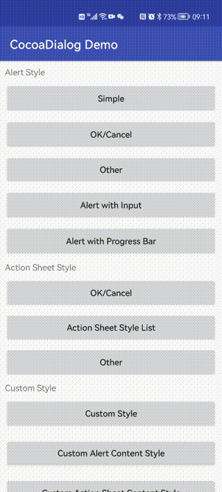
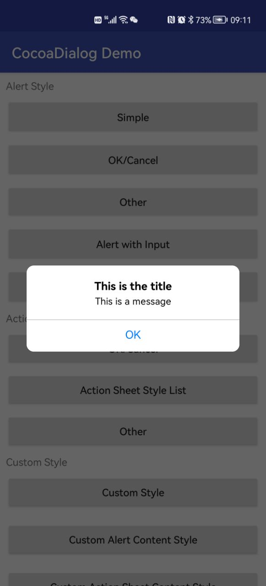
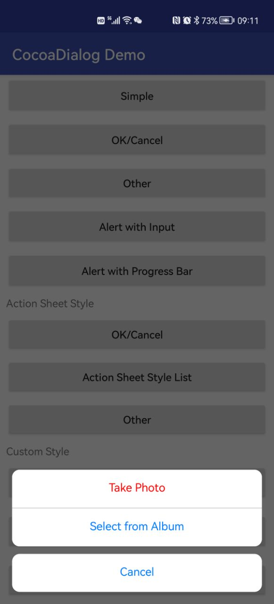

# 1. CocoaDialog

**CocoaDialog**
是一个仿iOS端UIAlertController实现的Android端的对话框控件，提供了普通对话框、带输入的对话框，以及底部弹出的菜单样式可选。只需简单三五行语句，便能引入类似iOS端对话框的效果。

**效果图**



## 1.1. 获取CocoaDialog
[](https://jitpack.io/#CrazyTaro/CocoaDialog)

使用JitPack，在project/build.gradle文件中添加如下内容:

```
allprojects {
    repositories {
        ...
        maven { url 'https://jitpack.io' }
    }
}
```

然后在app/build.gradle文件中添加如下内容，**Tag 请使用上述标识的版本号代替**。

```
dependencies {
	implementation 'com.github.CrazyTaro:CocoaDialog:Tag'
}
```

## 1.2. 如何使用 CocoaDialog

**CocoDialog**的使用方法非常简单，首先实例化CocoaDialog.Builder，配置对话框的标题，信息及按钮等信息，之后调用build()方法构建对话框，再调用show()
进行显示，示例代码如下：

```java
    CocoaDialog.Builder builder = new CocoaDialog.Builder(this, CocoaDialogStyle.alert);  
    builder.setTitle("Title for CocoaDialog");
    builder.setMessage("This is a message.");
    builder.addAction(new CocoaDialogAction("Cancel", CocoaDialogActionStyle.cancel, null));
    builder.addAction(new CocoaDialogAction("OK", CocoaDialogActionStyle.normal, new CocoaDialogAction.OnClickListener() {
        @Override
        public void onClick(CocoaDialog dialog) {
            Toast.makeText(getBaseContext(), "The ok button is clicked.", Toast.LENGTH_SHORT).show();
        }
    }));
    builder.build().show();
```

当然，你也可以使用如下的链式操作:

```java
	new CocoaDialog.Builder(this, CocoaDialogStyle.alert)
	    .setTitle("Title for CocoaDialog")
	    .setMessage("This is a message.")
    	.addAction(new CocoaDialogAction("Cancel", CocoaDialogActionStyle.cancel, null))
    	.addAction(new CocoaDialogAction("OK", CocoaDialogActionStyle.normal, new CocoaDialogAction.OnClickListener() {
        	@Override
        	public void onClick(CocoaDialog dialog) {
            	Toast.makeText(getBaseContext(), "The ok button is clicked.", Toast.LENGTH_SHORT).show();
        	}
    	}))
    	.build().show();

```

## 1.3. 弹窗样式

dialog 支持多种不同的样式

- CocoaDialogStyle.actionSheet，底部弹窗
- CocoaDialogStyle.alert，普通弹窗
- CocoaDialogStyle.custom，自定义弹窗，布局完全自定义
- CocoaDialogStyle.customAlertContent，自定义内容布局弹窗，但是标题、文本、按钮等延用alert类型的弹窗
- CocoaDialogStyle.customActionSheetContent，自定义内容布局弹窗，但是标题、文本、按钮等延用actionsheet类型的弹窗

弹窗类型一般是在创建时指定的，部分配置方法也会默认配置或修改弹窗类型。

### 1.3.1. 默认的弹窗类型指定及创建

普通弹窗是在屏幕居中位置弹出普通的弹窗，一般带有标题、内容、确认与取消按钮之类的操作。



```java
new CocoaDialog.Builder(this, CocoaDialogStyle.alert)
	.addAction(new CocoaDialogAction("Cancel", CocoaDialogActionStyle.cancel, null));
	.addAction(new CocoaDialogAction("OK", CocoaDialogActionStyle.normal, new CocoaDialogAction.OnClickListener() {
    	@Override
    	public void onClick(CocoaDialog dialog) {
        	Toast.makeText(getBaseContext(), "The ok button is clicked.", Toast.LENGTH_SHORT).show();
    	}
	}))
	.build().show();
```

底部弹窗是在屏幕底部弹出普通的弹窗，一般带有标题、内容、确认与取消按钮之类的操作。



```java
new CocoaDialog.Builder(this, CocoaDialogStyle.action_sheet_style)
	.addAction(new CocoaDialogAction("Cancel", CocoaDialogActionStyle.cancel, null));
	.addAction(new CocoaDialogAction("OK", CocoaDialogActionStyle.normal, new CocoaDialogAction.OnClickListener() {
    	@Override
    	public void onClick(CocoaDialog dialog) {
        	Toast.makeText(getBaseContext(), "The ok button is clicked.", Toast.LENGTH_SHORT).show();
    	}
	}))
	.build().show();
```

### 1.3.2. 特定弹窗类型的配置方法

- custom，自定义布局

**1.3.0版本** 增加了自定义ContentView的支持，使用时只需在构建时传入**CocoaDialogStyle.custom**样式，之后调用setCustomContentView(
View)，并通过setCustomWidth(int)和setCustomHeight(int)来设置需要的宽高即可。

使用custom样式时必须调用setCustomContentView(View)，否则会抛出异常。

setCustomWidth(int)和setCustomHeight(int)参数为像素值，同时也支持WindowManager.LayoutParams.MATCH\_PARENT 和
WindowManager.LayoutParams.WRAP\_CONTENT，设置为0或其他非法数值默认使用WindowManager.LayoutParams.WRAP\_CONTENT。


> 注意：自定义ContentView时仅提供对话框容器，其他方法(如setTitle、setMessage、addAction等)失效，如果ContentView中有需要与用户交互的控件需要开发者自行监听处理。

示例代码如下：

```java
    new CocoaDialog.Builder(this, CocoaDialogStyle.custom)
                        .setCustomWidth(WindowManager.LayoutParams.WRAP_CONTENT)
                        .setCustomHeight(WindowManager.LayoutParams.WRAP_CONTENT)
                        .setCustomContentView(LayoutInflater.from(this).inflate(R.layout.loading_dialog, null))
                        .build().show();
```

- customxxxContent，自定义内容布局

CocoaDialogStyle.customAlertContent，自定义内容布局弹窗，但是标题、文本、按钮等延用alert类型的弹窗

CocoaDialogStyle.customActionSheetContent，自定义内容布局弹窗，但是标题、文本、按钮等延用actionsheet类型的弹窗

在**1.4.0以后的版本**新增了自定义内容的支持，在保留了 alert 与 actionSheet 样式的弹窗中，可以配置自定义的内容，使用方式同 custom 是类似的。

> 注意：默认情况下，自定义内容一般是 wrap_content，因为弹窗本身不知道内容可能会有多大，所以需要显示相应的布局时一般是通过自适应的方式配置。

示例代码如下：

```java
    new CocoaDialog.Builder(this, CocoaDialogStyle.custom)
         .setCustomContentViewWithStyle(customView, CocoaDialogStyle.customAlertContent)
         .setCustomHeight(WindowManager.LayoutParams.WRAP_CONTENT)
         .setCustomContentView(LayoutInflater.from(this).inflate(R.layout.loading_dialog, null))
         .setTitle(R.string.dialog_title)
         .setMessage(R.string.dialog_message)
         // 自定义按钮字体颜色
         .addAction(R.string.cancel, CocoaDialogActionStyle.cancel, Color.RED, null)
         // 使用默认字体颜色，normal及cancel风格字体颜色默认为蓝色
         .addAction(R.string.ok, CocoaDialogActionStyle.normal, new CocoaDialogAction.OnClickListener() {
             @Override
             public void onClick(CocoaDialog dialog) {
                 Toast.makeText(getBaseContext(), "OK clicked.", Toast.LENGTH_SHORT).show();
             }
         })
         .build()
         .show();
```

## 1.4. 对话框按钮

**CocoaDialog**中的按钮，即**CocoaDialogAction**，共提供三种样式可供选择:

* 普通按钮，对应枚举值为CocoaDialogActionStyle.normal，文本颜色为#007AFF
*

取消按钮，对应枚举值为CocoaDialogActionStyle.cancel，文本颜色同normal，当对话框为alert样式时，若按钮少于三个，则取消按钮总在左边，若按钮多于三个，则取消按钮总在最下方；若对话框为actionSheet样式时，取消按钮则在最下方；

* 危险操作，对应枚举值为CocoaDialogActionStyle.destructive，样式与普通按钮相同，文本颜色为红色(#FF0000)，可用于提示用户该操作为危险操作。

**CocoaDialogAction**的构建方法CocoaDialogAction(String title, CocoaDialogActionStyle style,
OnClickListener listener)中共有三个参数：

* title: 按钮显示的文本，类型为String
* style: 按钮的样式，类型为枚举类型CocoaDialogActionStyle
* listener: 按钮点击事件监听器，按钮点击会回调监听器的onClick方法

**1.3.4版本** 新增按钮字体颜色自定义功能，新增构建方法参数color，可通过该参数对按钮字体颜色进行自定义

> 注：虽然回调方法中传入了CocoaDialog实例，但由于内部已经默认将对话框关闭掉了，调用者无需手动调用dismiss方法来取消对话框。

### 1.4.1. 取消对话框的强制关闭
对于某些情况，可能在点击后不想关闭掉弹窗，但是默认的情况下是弹窗都会在被点击后被关闭的。所以针对这种需求新增了一个对话框 action 配置，支持某些 action 保持弹窗不关闭的处理。

```java
new CocoaDialogAction("title",CocoaDialogActionStyle.normal,listener)
        .setKeepShowingWhenActionClick(true);
```

在配置了 `setKeepShowingWhenActionClick(true)` 之后，该 action 被点击后不会强制关闭弹窗，需要自行处理弹窗的关闭。

## 1.5. 其它快捷弹窗配置

### 1.5.1. 带输入的对话框

如果使用的是alert样式的**CocoaDialog**，可通过调用addEditText(EditTextConfigurationHandler configurationHandler)
方法来为对话框添加文本输入框，用户可在EditTextConfigurationHandler的回调方法onEditTextAdded(EditText editText)
中对添加到对话框中的输入框进行配置，如果修改输入类型，提示文本等。

> 注意，addEditText方法仅在alert样式下生效，且与addProgressBar方法互斥，两个方法同时调用只有最后调用的方法会生效。

通过调用 **CocoaDialog.getEditTextList()**
可获取到添加到对话框中的所有输入框，遍历该列表可获取所有文本框的实例，可进一步获取到用户输入的文本内容，列表中的顺序与添加顺序相同。

示例代码如下：

```java
    new CocoaDialog.Builder(this, "This is the title", "This is a message", CocoaDialogStyle.alert)
    	.addAction(new CocoaDialogAction("Cancel", CocoaDialogActionStyle.cancel, null));
    	.addAction(new CocoaDialogAction("OK", CocoaDialogActionStyle.normal, new CocoaDialogAction.OnClickListener() {
        	@Override
        	public void onClick(CocoaDialog dialog) {
        	    List<EditText> editTextList = dialog.getEditTextList();
            	if (editTextList != null && editTextList.size() > 0 && editTextList.get(0).length() > 0) {
                	Toast.makeText(getBaseContext(), editTextList.get(0).getText(), Toast.LENGTH_SHORT).show();
            	}
        	}
    	}))
    	.addEditText(this, new CocoaDialog.EditTextConfigurationHandler() {
        	@Override
        	public void onEditTextAdded(EditText editText) {
            	editText.setHint("Enter the username.");
        	}
    	})
    	.addEditText(this, new CocoaDialog.EditTextConfigurationHandler() {
        	@Override
        	public void onEditTextAdded(EditText editText) {
            	editText.setInputType(InputType.TYPE_CLASS_TEXT | InputType.TYPE_TEXT_VARIATION_PASSWORD);
            	editText.setHint("Enter the password.");
        	}
    	})
    	.build().show();
```

### 1.5.2. 带进度条的对话框

~~如果使用的是alert样式的**CocoaDialog**，可通过调用addProgressBar(ProgressBarBuildHandler handler)
方法来为对话框添加一个进度条，需在ProgressBarBuildHandler的回调方法build(Context context)
中构建并返回一个ProgressBar或其任意子类，之后可通过调用 **CocoaDialog.setProgress(int progress)** 或 **
CocoaDialog.getProgress()** 修改或获取当前进度条的进度。~~

> ~~注意，addProgressBar方法仅在alert样式下生效，且与addEditText方法互斥，两个方法同时调用只有最后调用的方法会生效。~~

```java
    final CocoaDialog dialog = new CocoaDialog.Builder(this)
                        .setTitle("下载文件")
                        .setMessage("正在拼命加载中...")
                        .addProgressBar(new ProgressBarBuildHandler/*<ProgressBar>*/() { // 1.3.2之后移除了此处无意义泛型，旧版还需使用泛型
                            @Override
                            public ProgressBar build(Context context) {
                                return new ProgressBar(context, null, android.R.attr.progressBarStyleHorizontal);
                            }
                        }).addAction(new CocoaDialogAction("取消", CocoaDialogActionStyle.cancel, new CocoaDialogAction.OnClickListener() {
                            @Override
                            public void onClick(CocoaDialog dialog) {
                                // 取消下载的操作
                            }
                        })).build();
    dialog.show();
    new Handler().postDelayed(new Runnable(){
    	public void run() {
    		dialog.setProgress(50);
    }, 1000);
```

考虑兼容的及自定义UI的问题，此处配置带进度条的对话框已经发生了变更。

需要添加进度条时，请使用`addProgressBar(@NonNull IProgressBarProcessor handler)`，进度条对象只要求是一个view，不再要求必须是一个
progressBar.

```java
final CocoaDialog dialog = new CocoaDialog.Builder(this)
        .setTitle("下载文件")
        .setMessage("正在拼命加载中...")
        .addProgressBar(new ProgressBarProcessorImpl(new ProgressBar(this, null, android.R.attr.progressBarStyleHorizontal)))
        .addAction(new CocoaDialogAction("取消", CocoaDialogActionStyle.cancel, new CocoaDialogAction.OnClickListener() {
            @Override
            public void onClick(CocoaDialog dialog) {
                handler.removeCallbacks(loading);
            }
        })).setOnCancelListener(new DialogInterface.OnCancelListener() {
            @Override
            public void onCancel(DialogInterface dialog) {
                handler.removeCallbacks(loading);
            }
        }).build();
```

原方法依然是有效的，但是不再建议使用。如果需要保持原方法的实现，建议使用内置的实现类代替：`ProgressBarProcessorImpl`

```java
ProgressBarBuildHandler handler=xxx;
IProgressBarProcessor processor=new ProgressBarProcessorImpl(handler.build(context));
final CocoaDialog dialog = new CocoaDialog.Builder(this)
        .setTitle("下载文件")
        .setMessage("正在拼命加载中...")
        .addProgressBar(processor)
        .addAction(new CocoaDialogAction("取消", CocoaDialogActionStyle.cancel, new CocoaDialogAction.OnClickListener() {
            @Override
            public void onClick(CocoaDialog dialog) {
                handler.removeCallbacks(loading);
            }
        })).setOnCancelListener(new DialogInterface.OnCancelListener() {
            @Override
            public void onCancel(DialogInterface dialog) {
                handler.removeCallbacks(loading);
            }
        }).build();
```

### 1.5.3. 底部列表弹窗
新版本新增了底部列表的弹窗快捷配置方式，配置多个列表型弹窗不再需要一个个 action 添加，支持一次性添加。

```java
List<? extends ICocoDialogActionContent> items = Arrays.asList(
        new CocoaDialogActionContent("First Item"),
        new CocoaDialogActionContent("Second Item"),
        new CocoaDialogActionContent("Third Item"),
        new CocoaDialogActionContent("Fourth Item"),
        new CocoaDialogActionContent("Fifth Item，keep showing")
                .setKeepShowingWhenActionClicked(true),
        new CocoaDialogActionContent("Cancel", CocoaDialogActionStyle.cancel)
);
new CocoaDialog.Builder(this, CocoaDialogStyle.actionSheet)
        .setActionSheetList(items, new OnCocoaDialogActionItemClickListener() {
            @Override
            public void onItemClick(@NonNull CocoaDialog dialog, int index, @NonNull ICocoDialogActionContent content) {
                Toast.makeText(getBaseContext(), content.getTitle() + " clicked.", Toast.LENGTH_SHORT).show();
            }
        })
        .build().show();
```

## 1.6. 反馈

如果遇到问题或者好的建议，请反馈到我的邮箱：522852537@qq.com

如果觉得对你有用的话，点一下右上的星星赞一下吧
